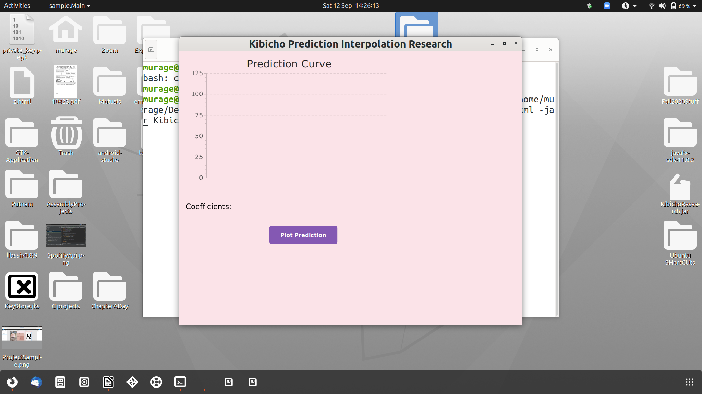

# JavaFX-Interpolator
Cross-platform desktop apps using JavaFX and the JDK - I was trying to visulaize see what my data looked lke when I interpolated it. Tested on my MacBook Pro and my HP Spectre running Ubuntu

On HP

On Mac

